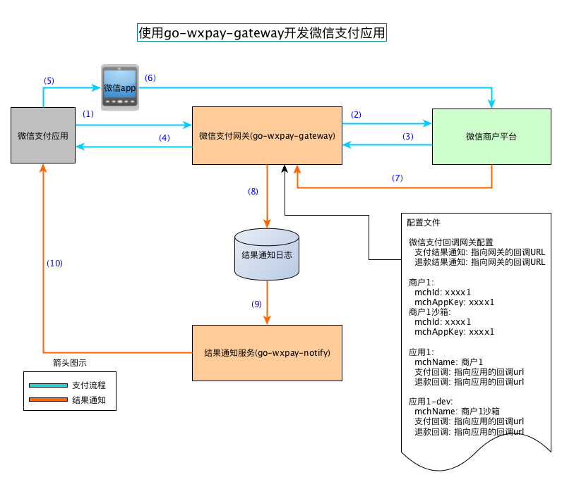

# 通用微信支付网关服务

 1. `go-wxpay-gateway`是封装了与微信支付的相关接口，以更简便易用的形式(封装了各种编码、加解密、证书、
     随机数、沙箱的使用)让应用使用微信支付功能
 1. `go-wxpay-gateway`运行后，通过HTTP给需要微信支付的应用提供接口，请求与响应的数据都是JSON，任何支持
     HTTP的语言都可以实现业务代码。

## 架构图

 

 - 任何商户平台的配置信息都统一由`go-wxpay-gateway`集中管理，应用只要通过`应用名`、`appId`就可以使用这些参数
 - 任何通知结果的回调信息都统一由`go-wxpay-gateway`接收，然后由`go-wxpay-notify`程序根据应用配置的回调参数进行分发
 - 下单、支付、支付结果通知流程
     1. `微信支付应用`准备好支付信息(订单号、支付金额)，根据应用类型选取相应的支付方式(JSAPI/H5/APP/NATIVE)，
         同时把`应用名`、`appId`提供给`go-wxpay-gateway`
     1. `go-wxpay-gateway`取出`应用名`对应的配置信息，附上`支付结果通知URL`向`微信商户平台`发出统一支付接口调用
     1. `微信商户平台`返回相应的支付参数
     1. `go-wxpay-gateway`抽取支付相关的参数，**生成**或**包装**`激活微信支付`的参数，返回给`微信支付应用`
     1. `微信支付应用`把相关参数返回给前端 或者 提供二维码 激活`微信app`
     1. 用户通过`微信app`完成支付
     1. `微信商户平台`异步把支付结果通知给`支付结果通知URL`，该URL由`go-wxpay-gateway`侦听
     1. `go-wxpay-gateway`根据其中的`应用名`找到配置文件中实际的`支付回调`URL，生成`结果通知日志`
     1. 结果通知服务`go-wxpay-notify`一直侦听`结果通知日志`的变化
     1. 把结果分发给指定的`支付回调`URL

## 下载、编译方法
 1. 前提：已经安装go 1.11.x及以上、git、make
 2. 进入任一文件夹，执行命令

    ```bash
    $ git clone https://github.com/rosbit/go-wxpay-gateway
    $ cd go-wx-gateway
    $ make
    ```
 3. 编译成功，会得到3个可执行程序
     - `go-wxpay-gateway`: 微信支付网关程序，可以执行`./go-wxpay-gateway -v`显示程序信息。
     - `go-wxpay-notify`:  支付结果通知服务程序，可以执行`./go-wxpay-notify -v`显示程序信息。
     - `go-wxpay-getsandbox`: 获取沙箱测试的appKey工具，可以执行`./go-wxpay-getsandbox -v`显示程序信息。
 4. Linux的二进制版本可以直接进入[releases](https://github.com/rosbit/go-wxpay-gateway/releases)下载

## 运行方法
### go-wxpay-gateway运行方法
 1. 环境变量
    - CONF_FILE: 指明配置的路径，格式见下文
 1. 配置文件格式
    - 是一个JSON
    - 可以通过`wxpay-gateway.conf.sample.json`进行修改:
    - 其中的`merchants`定义了商户的信息，实际账号和沙箱账号请分别配置
    - 其中的`apps`定义了应用的信息，项`name`就是`应用名`
         - `应用名`只要可以区分`微信支付应用`就可以了
         - 如果使用沙箱测试，另外配置一个带`-dev`后缀的`应用名`，如`app-dev`，并指向沙箱merchant信息，
           `微信支付应用`使用`app-dev`时不产生实际的费用；等测试成功后，再切换到实际的`应用名`，如`app`
    - 其中的项`notify-file`指的的是`通知结果日志`文件名
    - 其中的项`notify-pay-url`、`notify-refund-url`是外网可以访问的URL，而且需要路由到项`endpoints`中的
      `notify-pay`和`notify-refund`
    - 配置项`endpoints`中的其它路由确保内网可以使用就可以了
 1. 运行
    - `$ CONF_FILE=./wxpay-gateway-conf.json ./go-wxpay-gateway`

### go-wxpay-notify运行方法
 1. 环境变量
    - CONF_FILE: 指明配置的路径，格式见下文
 1. 配置文件格式
    - 是一个JSON
    - 可以通过`wxpay-notify.conf.sample.json`进行修改:
    - 其中的`notify-file`是`通知结果日志`文件名，这个必须和`go-wxpay-gateway`中的相应配置一致
 1. 运行
    - `$ CONF_FILE=./wxpay-notify-conf.json ./go-wxpay-notify`

### go-wxpay-getsandbox运行方法
 - 运行`./go-wxpay-getsandbox <appId> <mchId> <mchAppKey>`
     - 其中&lt;appId&gt;是指公众号、小程序、网页应用等id，请根据应用类型选用正确的appId
     - &lt;mchId&gt;是指商户号，申请商户号的时可以拿到
     - &lt;mchAppKey&gt;是商户号的appKey，可以进入商户号管理界面设定
 - 运行成功后把沙箱mchAppKey输出到屏幕

## go-wxpay-gateway服务的接口参数
 1. 创建订单
    - 对应配置项: `create-pay`
    - 访问方法: POST
    - URI: 如配置值为`/wxpay/create-pay`，则通过`/wxpay/create-pay/<type>`访问，&lt;type&gt;的可取值为`JSAPI`、`H5`、`APP`、`NATIVE`
    - **[注意]** 由于该接口会使用商户相关的配置信息，该接口不要暴露在外网，只要支付应用可以访问就可以了
    - 以下为各种支付方式的参数、响应结果说明:
       1. JSAPI支付
           - URI: `/wxpay/create-pay/JSAPI`
           - 请求参数

              ```json
              {
                 "appId": "公众号或小程序的appId",
                 "payApp": "go-wxpay-gateway配置文件中的应用名",
                 "goods": "商品名",
                 "udd": "用户自定义数据",
                 "orderId": "支付应用中唯一的订单号",
                 "fee": 以分为单位的支付额度,
                 "ip": "创建订单的IP地址",
                 "openId": "支付用户在公众号或小程序中的openId"
              }
              ```

           - 响应结果

             ```json
             {
                 "code": 200,
                 "msg": "OK",
                 "result":{
                    "jsapi_params":{
                       "appId": "wxc914c55fba939e3c",
                       "nonceStr": "Q6cU6oyVVvSsIWusb20dett1X59h4ezA",
                       "package": "prepay_id=wx20190530150713356368",
                       "paySign": "4F676F3FF2F4719289EA0685928CF83B",
                       "signType": "MD5",
                       "timeStamp": "1559200033"
                    },
                    "prepay_id": "wx20190530150713356368"
                  }
             }
             ```

       1. H5支付
           - URI: `/wxpay/create-pay/H5`
           - 请求参数

             ```json
             {
                 "appId": "公众号或小程序的appId",
                 "payApp": "go-wxpay-gateway配置文件中的应用名",
                 "goods": "商品名",
                 "udd": "用户自定义数据",
                 "orderId": "支付应用中唯一的订单号",
                 "fee": 以分为单位的支付额度,
                 "ip": "创建订单的IP地址",
                 "redirectUrl": "在支付成功后需要跳转的URL",
                 "sceneInfo": {
                    "h5_info": {
                      "type": "类型",
                      "wap_name": "wap应用名",
                      "wap_url": "wap-site-url"
                    }
                    // ---- OR ----
                    "h5_info": {
                      "type": "类型",
                      "app_name":"ios应用名",
                      "bundle_id": "ios-bundle-id"
                    }
                    // ---- OR ----
                    "h5_info": {
                      "type": "类型",
                      "app_name":"android应用名",
                      "package_name": "android-package-name"
                    }
                  }
             }
             ```

           - 响应结果

             ```json
             {
                  "code": 200,
                  "msg": "OK",
                  "result":{
                      "pay_url": "weixin://wxpay/s/An4baqw?redirect_url=http%3A%2F%2Flocalhost%3A11083",
                      "prepay_id": "wx20190530150945625582"
                   }
             }
             ```

       1. APP支付
           - URI: `/wxpay/create-pay/APP`
           - 请求参数

             ```json
             {
                 "appId": "公众号或小程序的appId",
                 "payApp": "go-wxpay-gateway配置文件中的应用名",
                 "goods": "商品名",
                 "udd": "用户自定义数据",
                 "orderId": "支付应用中唯一的订单号",
                 "fee": 以分为单位的支付额度,
                 "ip": "创建订单的IP地址"
             }
             ```

           - 响应结果

             ```json
             {
                 "code": 200,
                 "msg": "OK",
                 "result":{
                    "prepay_id": "wx20190530151116852853",
                    "req_params":{
                       "appid": "wxc914c55fba939e3c",
                       "noncestr": "iAQIoaqU854JHNnDhG00C0QSbTdIfthD",
                       "package": "Sign=WXPay",
                       "partnerid": "Iamyourpartner",
                       "prepayid": "wx20190530151116852853",
                       "sign": "1ADDF00C546912C446D9B9EA847B0D0F",
                       "timestamp": "1559200276"
                    }
                  }
             }
             ```

       1. NATIVE支付
           - URI: `/wxpay/create-pay/NATIVE`
           - 请求参数

              ```json
              {
                  "appId": "公众号或小程序的appId",
                  "payApp": "go-wxpay-gateway配置文件中的应用名",
                  "goods": "商品名",
                  "udd": "用户自定义数据",
                  "orderId": "支付应用中唯一的订单号",
                  "fee": 以分为单位的支付额度,
                  "ip": "创建订单的IP地址",
                  "productId": "商品ID"
               }
               ```

           - 响应结果

               ```json
               {
                   "code": 200,
                   "msg": "OK",
                   "result":{
                       "code_url": "weixin://wxpay/s/An4baqw",
                       "prepay_id": "wx20190530151411214102"
                    }
               }
               ```

 1. 查询支付
    - 对应配置项: `query-order`
    - 访问方法: POST
    - URI: 直接根据配置值访问，如`/wxpay/queryorder`
    - **[注意]** 该接口配置成一个内网可以访问的API
    - 请求参数

      ```json
      {
          "appId": "应用的appId",
          "payApp": "go-wxpay-gateway配置文件中的应用名",
          "orderId": "支付应用中的唯一订单id号"
      }
      ```

    - 响应结果

      ```json
      {
          "app_id": "wxc914c55fba939e3c",
          "mch_id": "1530730681",
          "device_info": "sandbox",
          "result_code": "SUCCESS",
          "err_code": "SUCCESS",
          "err_code_des": "SUCCESS",
          "open_id": "wxd930ea5d5a258f4f",
          "is_subscribe": true,
          "trade_type": "JSAPI",
          "bank_type": "CMC",
          "total_fee": 101,
          "settlement_total_fee": 101,
          "fee_type": "CNY",
          "cash_fee": 101,
          "cash_fee_type": "CNY",
          "coupon_fee": 0,
          "coupon_count": 0,
          "coupons": null,
          "transaction_id": "4662714807620190530105704209783",
          "order_id": "o002",
          "attach": "sandbox_attach",
          "time_end": "20190530105704"
      }
      ```

 1. 创建退款
    - 对应配置项: `create-refund`
    - 访问方法: POST
    - URI: 直接根据配置值访问，如`/wxpay/create-refund`
    - **[注意]** 该接口配置成一个内网可以访问的API
    - 请求参数

      ```json
      {
          "appId": "应用的appId",
          "payApp": "go-wxpay-gateway配置文件中的应用名",
          "orderId": "支付应用中的唯一订单id号",
          "refundId": "支付应用中的唯一退款id号",
          "totalFee": 支付的总费用，单位分,
          "refundFee": 退款的费用，单位分,
          "refundReason": "退款理由"
      }
      ```

    - 响应结果

      ```json
      {
          "code": 200,
          "msg": "OK",
          "result":{
            "app_id": "wxc914c55fba939e3c",
            "mch_id": "1530730681",
            "result_code": "",
            "err_code": "SUCCESS",
            "err_code_des": "",
            "transaction_id": "4630338607020190530111333587924",
            "order_id": "o002",
            "wx_refund_id": "4630338607020190530111333587",
            "refund_id": "r002",
            "total_fee": 101,
            "settlement_total_fee": 0,
            "refund_fee": 101,
            "settlement_refund_fee": 0,
            "fee_type": "CNY",
            "cash_fee": 101,
            "cash_fee_type": "CNY",
            "cash_refund_fee": 101,
            "coupon_refund_fee": 0,
            "coupon_refund_count": 0,
            "refund_coupons": null
          }
      }
      ```

 1. 分发通知结果
    - 分发支付结果
       - URI: 对应配置文件里`apps`列表中的某个`notify-pay-callback`，可以是一个内网地址
       - 方法: POST
       - 请求参数:

           ```json
           {
              "result_code": "SUCCESS",
              "err_code": "SUCCESS",
              "err_code_des": "SUCCESS",
              "mch_id": "1530730681",
              "device_info": "APP",
              "trade_type": "APP",
              "attach": "any",
              "bank_type": "CMC",
              "fee_type": "CNY",
              "total_fee": 101,
              "settlement_total_fee": 101,
              "cash_fee_type": "CNY",
              "cash_fee": 101,
              "coupon_count": 0,
              "coupons": null,
              "is_subscribe": true,
              "open_id": "sandboxopenid",
              "order_id": "o003",
              "time_end": "20190530151118",
              "transaction_id": "4391741731420190530151118238943"
           }
           ```

       - 响应结果:
           - 由应用自己决定

    - 分发退款结果
       - URI: 对应配置文件里`apps`列表中的某个`notify-refund-callback`，可以是一个内网地址
       - 方法: POST
       - 请求参数:
           - 参考**创建退款**`响应结果`中的`result`
       - 响应结果:
           - 由应用自己决定
